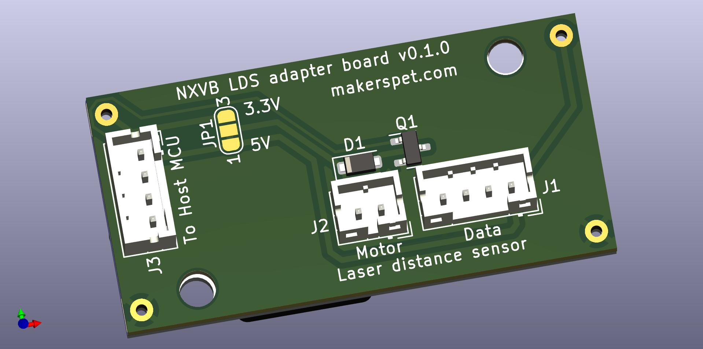
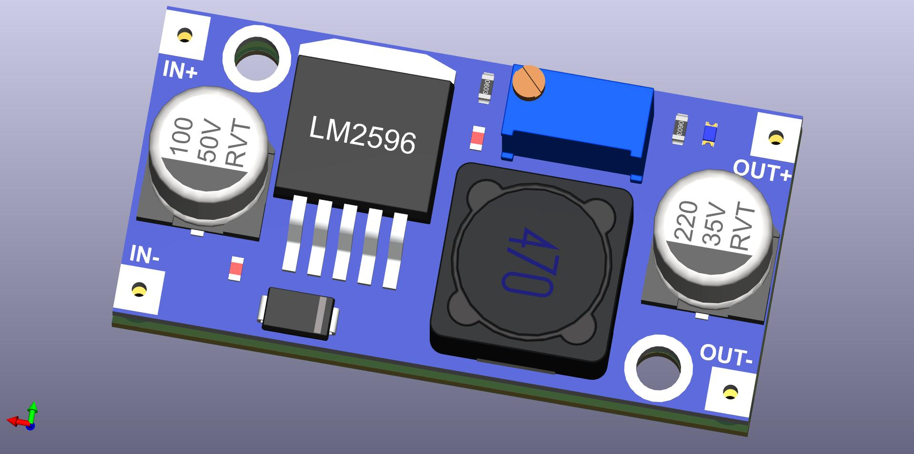

# Adapter PCB for LDS02RR laser distance scanner

Connect Neato XV/Botvac LDS to Arduino to capture laser distance data.

This PCB implements PWM motor control for Neato XV/Botvac LDS. Find
sample Arduino ESP32 firmware code [here](https://github.com/kaiaai/LDS02RR_ESP32).

## Files
- [schematic PDF](output/Neato_adapter_schematic.pdf)
- [BoM .CSV](output/Neato_adapter_BOM.csv), [BoM .XML](output/Neato_adapter_BOM.xml)
- [Gerber .ZIP](output/Neato_adapter_gerber.zip)
- [3D model .STEP](output/Neato_adapter.step)
- KiCAD schematic, layout - in this folder

## Top

## Bottom

# Change log

## v0.1.0
- initial prototype
- optional LM2596 voltage regulator module provides 3.3V to motor