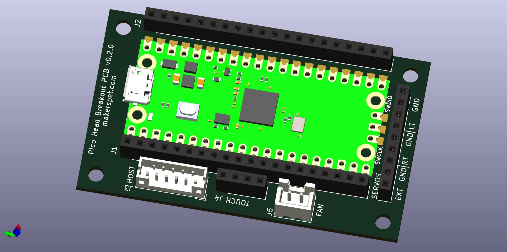
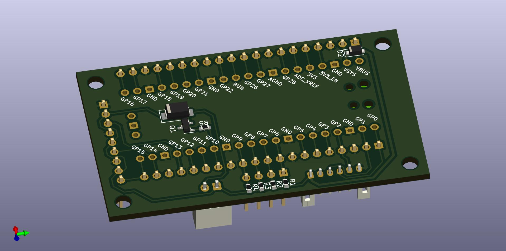

# Raspberry Pi Pico Head Breakout PCB for Maker's Pet robots

## Files
- [schematic PDF](output/pico_breakout_head_schematic.pdf)
- [BoM .CSV](output/pico_breakout_head_bom.csv), [BoM .XML](output/pico_breakout_head_bom.xml)
- [Gerber .ZIP](output/pico_breakout_head_gerber.zip)
- [3D model .STEP](output/pico_breakout_head.step)
- KiCAD schematic, layout - in this folder

## Top

## Bottom

# Change log

## v0.2.0 PCB prototype
- fan N-MOSFET fix
- removed fan diode
  - unnecessary for such a small motor

## v0.1.1 PCB prototype
- use same diode components
- removed fan MOSFET gate resistor

## v0.1 PCB prototype
- I2C host interface connector
- fan connector
- connector for 3 servos
  - left and right ears plus one extra
- touch connector with 4 segments
